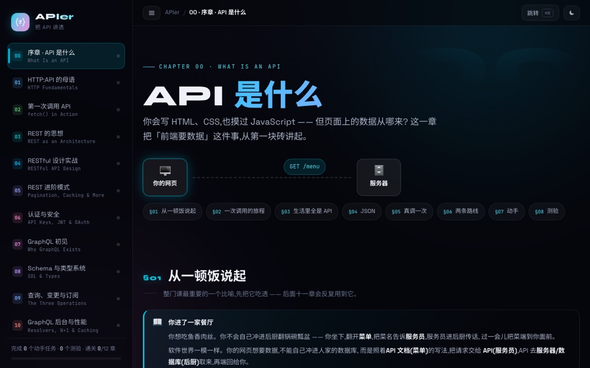
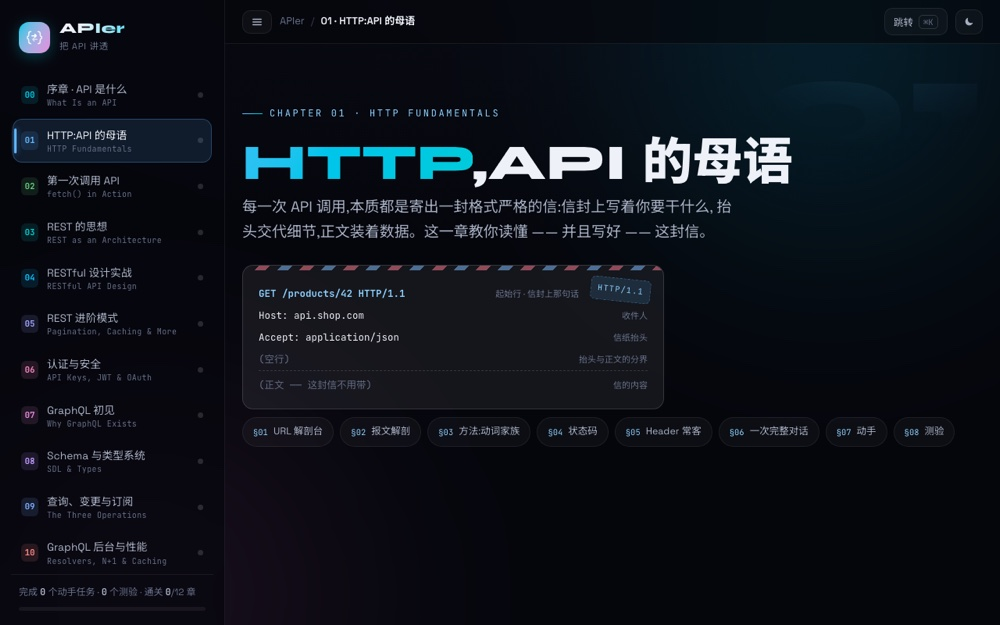

# APIer — an interactive course on HTTP, REST and GraphQL

**▶ [Open the course](https://apier-eta.vercel.app)** — runs in your browser, nothing to install.

An interactive API course for people starting from zero. It begins at "what is an API" and
goes far enough into both **REST** and **GraphQL** that you can design an API in either and choose between them.

Sister sites: [DataData](https://data-data.vercel.app) (data structures) and
[AlgoAlgo](https://algo-algo.vercel.app) (algorithms) — same design language.



*The course home — 12 chapters across REST and GraphQL*



*HTTP: status codes, methods and headers, explored interactively*

## Chapters

| # | Chapter | What it covers |
|---|---|---|
| 00 | Prologue — what an API is | The restaurant analogy · client/server · JSON · your first real request |
| 01 | HTTP, the native tongue | URL anatomy · methods and idempotency · status codes · headers · the message |
| 02 | Your first call | fetch · async/await · the `res.ok` trap · POST · DevTools |
| 03 | The ideas behind REST | The six constraints · resources and representations · the maturity model · HATEOAS |
| 04 | Designing RESTful APIs | URL naming · CRUD mapping · choosing status codes · RFC 9457 error format |
| 05 | REST in production | Pagination · filtering · versioning · ETag caching · idempotency keys · rate limits · OpenAPI |
| 06 | Auth and security | API keys · Basic · JWT · OAuth 2.0 · CORS · HTTPS |
| 07 | Meeting GraphQL | Over- and under-fetching · your first query · one endpoint · GraphiQL |
| 08 | Schema and type system | SDL · scalars and modifiers · the type graph · interface/union/input · introspection |
| 09 | Queries, mutations, subscriptions | Variables, aliases, fragments, directives · mutations · subscriptions · errors and pagination |
| 10 | GraphQL servers and performance | Resolvers · the N+1 problem · DataLoader · caching · security limits |
| ✦ | Finale — the comparison | Side by side on every axis · a decision tree · GitHub and Shopify case studies · final quiz |

Each chapter follows the same rhythm: an intuition first, then an interactive
visualization, then code you can actually run, then the common mistakes, then a hands-on
task against a real public API, then a quiz. Progress is stored locally in the browser.

## Running locally

Requires Node 22:

```bash
nvm use
npm install
npm run dev        # http://localhost:3000
```

Build with type checking: `npm run build`.

## Structure

Next.js 15 (App Router) + TypeScript + React 19, plain CSS, no Tailwind. No API routes, so the whole site prerenders to static pages.

Each chapter is one folder under `app/` holding its page, its visualizations (`viz.tsx`) and
its own stylesheet, paired with a data file under `lib/` for quizzes and exercises.

---

© 2026 Weiren Feng. All rights reserved. Published for reading and portfolio purposes; not
licensed for reuse, modification, or redistribution.
